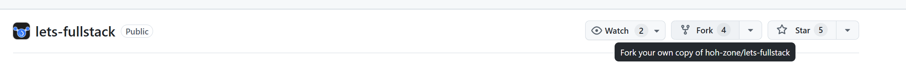
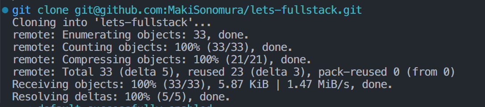
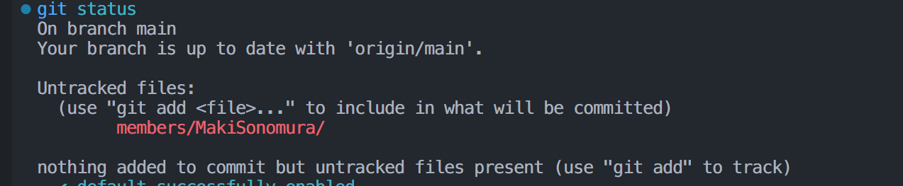
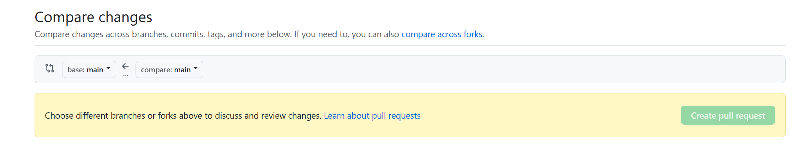

# Git

**Git** is a free, open-source, distributed version control system that developers use to track changes in source code during software development. Created by Linus Torvalds in 2005, Git allows developers to collaborate on projects, maintain a history of code changes, and revert to previous versions if needed. It’s widely used in both small and large development projects, from personal coding projects to large-scale software development across multiple teams.

Git’s distributed model allows every developer to have a local copy (or "clone") of the entire codebase, including its full history, so they can work offline and synchronize changes with a central repository when they’re ready.

## Common Git Usage

### 1. **Initial Setup**
   ```bash
   git config --global user.name "Your Name"
   git config --global user.email "your_email@example.com"
   ```
   Configures your name and email for commits.

### 2. **Creating a Repository**
   ```bash
   git init
   ```
   Initializes a new Git repository in the current directory.

### 3. **Cloning a Repository**
   ```bash
   git clone <repository_url>
   ```
   Creates a local copy of a remote repository.

### 4. **Checking Repository Status**
   ```bash
   git status
   ```
   Shows the current status of the working directory and staging area, such as modified, staged, or untracked files.

### 5. **Adding Changes to Staging**
   ```bash
   git add <file>        # Add a specific file
   git add .             # Add all changes in the current directory
   ```
   Moves files from the working directory to the staging area in preparation for a commit.

### 6. **Committing Changes**
   ```bash
   git commit -m "Commit message here"
   ```
   Saves the changes from the staging area to the repository with a descriptive message.

### 7. **Viewing Commit History**
   ```bash
   git log
   ```
   Shows a list of past commits, each with its unique commit ID, author, date, and message.

### 8. **Pushing Changes to a Remote Repository**
   ```bash
   git push origin <branch_name>
   ```
   Uploads local changes to a remote repository.

### 9. **Pulling Changes from a Remote Repository**
   ```bash
   git pull origin <branch_name>
   ```
   Downloads changes from a remote repository and merges them into the local branch.

### 10. **Branching**
   ```bash
   git branch <branch_name>     # Creates a new branch
   git checkout <branch_name>   # Switches to the specified branch
   ```
   Branching allows developers to work on new features or fixes without disturbing the main codebase.

### 11. **Merging Branches**
   ```bash
   git checkout <target_branch>
   git merge <source_branch>
   ```
   Combines changes from one branch into another.

### 12. **Resolving Merge Conflicts**
   If there are conflicts when merging, Git will indicate which files are in conflict. Open the files, manually resolve conflicts, then add and commit the resolved files.
   
### 13. **Reverting Changes**
   ```bash
   git revert <commit_id>
   ```
   Creates a new commit that undoes the changes of a previous commit, keeping history intact.

### 14. **Undoing Local Changes**
   ```bash
   git checkout -- <file>   # Reverts uncommitted changes to the last commit
   git reset <file>         # Unstages a file from the staging area
   ```

### Summary

Git commands are structured for tracking changes efficiently, making collaboration smoother, and giving full control over version history. Understanding and using these common commands will streamline your development workflow and make managing codebases more efficient.


### Typical Workflow with Git
Next I will introduce you to a typical Git workflow


### 1. **Fork the Repository**
1. Go to the repository you want to contribute to on GitHub.
2. Click on the **Fork** button at the top right of the page. This will create a copy of the repository in your own GitHub account.
<!--  -->


### Step 2: **Clone the Forked Repository**
Download a local copy of your forked repository so you can start making changes:
```bash
git clone <your_forked_repo_url>
cd <repository_name>
```


### Step 3: **Create a New Branch for Your Changes**
Create a branch to isolate your changes. Name it descriptively, such as 
`member/helloworld`
```bash
git checkout -b <feature-branch-name>
```
### Step 4: **Make Changes Locally**
Make the necessary code changes or additions in your working directory. After making changes, check which files have been modified:


### Step 5: **Stage and Commit Your Changes**
Add the files you want to include in your commit:
```bash
git add <file-name>    # Add specific file
git add .              # Add all changes in directory
```
Then commit with a descriptive message:
```bash
git commit -m "Brief description of changes"
```

### Step 6: **Push Your Branch to Your Fork on GitHub**
Push your branch to the forked repository on GitHub:
```bash
git push origin <feature-branch-name>
```
### Step 7: **Open a Pull Request (PR)**
- Go to your forked repository on GitHub.
- You should see an option to Compare & pull request for the recently pushed branch. Click on it.
- Add a descriptive title and a summary of your changes.
- Select the correct branch from the original repository (usually main or master) to compare against.
- Submit the Pull Request for review.

### Step 8: **Wait**
If the authors recognizes your post, just wait for them to merge it, otherwise you can keep modifying it until it's merged.