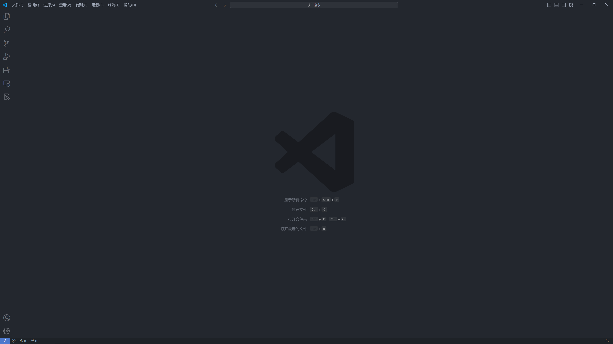
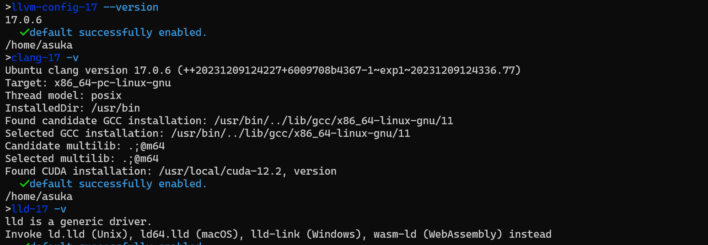
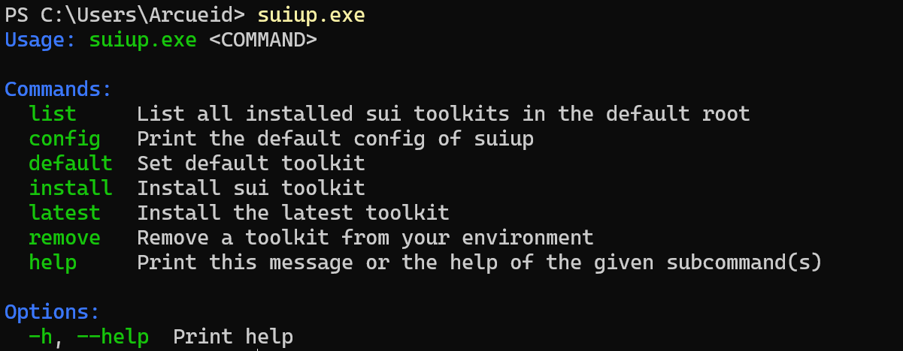

# IDE and Environments


### 1. **Windows Terminal**

If you're not planning to use `Windows`, feel free to skip this. However, we do recommend giving it a shot! Modern Windows versions have greatly enhanced development capabilities, moving past the stereotypes of older versions. You can find the tutorial on [Install Windows Terminal](https://learn.microsoft.com/en-us/windows/terminal/install)

### 2. **Visual Studio Code**


You can find all installers on [Download Visual Studio Code](https://code.visualstudio.com/download)
#### Windows


#### Linux and macOS


### 3. **Install WSL**

[Install Ubuntu on WSL2](https://documentation.ubuntu.com/wsl/en/latest/guides/install-ubuntu-wsl2/)


### 4. **Development Environment**


<!-- #### 1. **Install Development Toolkits** -->
#### 1. **Clang/LLVM**
If you don't intend to develop LLVM, it's sufficient to install a newer, more stable version. We recommend you to install it from LLVM's download page: [LLVM Debian/Ubuntu nightly packages](https://apt.llvm.org/)
```bash
# For convenience there is an automatic installation script available that installs LLVM for you.
To install the latest stable version:
bash -c "$(wget -O - https://apt.llvm.org/llvm.sh)"

# To install a specific version of LLVM:
wget https://apt.llvm.org/llvm.sh
chmod +x llvm.sh
sudo ./llvm.sh <version number>
To install all apt.llvm.org packages at once:
wget https://apt.llvm.org/llvm.sh
chmod +x llvm.sh
sudo ./llvm.sh <version number> all
# or
sudo ./llvm.sh all

```
After installation, you can run 
```bash
clang-${verison} -v           
llvm-config-${version} --verion 
```

#### 2. **Rust**
`Rustup` is the official toolchain version manager for managing versions and targets in your host. To install it and `Rust`, you can find [Install Rust](https://www.rust-lang.org/tools/install)


#### 3. **Sui**

- The official guide to install `Sui`: [Install Sui](https://docs.sui.io/guides/developer/getting-started/sui-install)
- Similar to `Rustup`, I've developed `Suiup` to manage the versions of `Sui`, and you can try it out [here](https://github.com/MakiSonomura/suiup). After you install it successfully, you can see: 